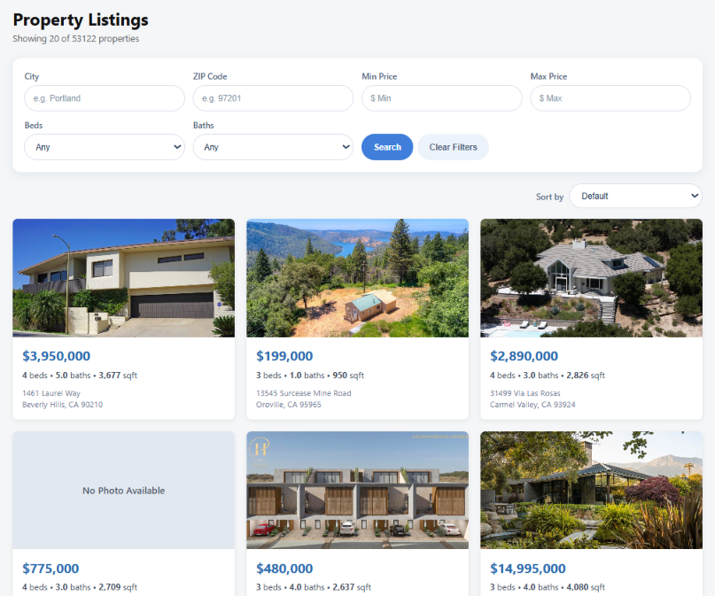

# IDX Exchange Property Search Platform

## Project Description
A full-stack, RedFin/Zillow-style property search application backed by real MLS property data. Built with React, Node.js, Express, and MySQL. Features include property searching, filtering, sorting, photo galleries, and open house information. 



## Tech Stack
-  Frontend: React (Create React App) 19.x
- Routing: React Router DOM 7.x
- Backend: Node.js 18.x + Express 5.2.1
- Database: MySQL 8.x
- Container: Docker Desktop (Latest)
- Testing: Jest 30.5.0 + React Testing Library + Supertest

## Local Setup Instructions
### Prerequisites

Install the following:

- Git
- Node.js LTS
- Docker Desktop
- npm
- Visual Studio Code

### 1. Clone the repository

```powershell
git clone https://github.com/YOURUSERNAME/idxexchange.git
cd idxexchange
```
Replace `YOURUSERNAME` with your GitHub username.

### 2. Start MySQL database

Start Docker Desktop. Then, create the MySQL container: 

```powershell
docker run --name idx-mysql-local `
  -e MYSQL_ROOT_PASSWORD=YOURPASSWORD `
  -e MYSQL_DATABASE=rets `
  -p 3306:3306 `
  -d mysql:8
```
Replace `YOURPASSWORD` with the MySQL root password.

### 3. Import the MLS data

Property data
```powershell
docker exec -i idx-mysql-local mysql -u root -pYOURPASSWORD rets < rets_property.sql
```
Open house data
```powershell
docker exec -i idx-mysql-local mysql -u root -pYOURPASSWORD rets < rets_openhouse.sql
```
Replace `YOURPASSWORD` with the MySQL root password.

### 4. Set up the backend
```powershell
cd backend
npm install
```

Create an `.env` file inside the backend directory.
```powershell
PORT=5000
DB_HOST=localhost
DB_PORT=3306
DB_USER=root
DB_PASSWORD=YOURPASSWORD
DB_NAME=rets
```
Replace `YOURPASSWORD` with the MySQL root password.

Start the backend
```powershell
npm run dev
```

### 5. Set up the frontend
```powershell
cd frontend
npm install
npm start
```

Application should open at `http://localhost:3000`

## API Endpoint Reference
### GET /api/health

Checks if backend is connected to database

Example Request: 
```powershell
http://localhost:5000/api/health
```
Example Response: 
```powershell
{
  "status": "ok",
  "database": "connected"
}
```

### GET /api/properties

Returns properties with pagination, filtering, and sorting

| **Parameter** | **Description** |
| ------------- | ---------------- |
| `city`        | Filters by city |
| `zipcode`     | Filters by ZIP code |
| `minPrice`    | Sets minimum listing price |
| `maxPrice`    | Sets maximum listing price |
| `beds`        | Filters by number of bedrooms |
| `baths`       | Filters by number of bathrooms |
| `limit`       | Sets number of results per page |
| `offset`      | Sets number of results to skiip |
| `sortBy`      | Selects chosen property field for sorting |
| `sortOrder`   | Selects ascending or descending order |

Example Request: 
```powershell
http://localhost:5000/api/properties?city=Los%20Angeles&minPrice=500000&beds=2&limit=20&offset=0
```
Example Response: 
```powershell
{
    "total": 884,
    "limit": 20,
    "offset": 0,
    "sortBy": null,
    "sortOrder": null,
    "results": [
        {
            "id": 2676,
            "L_ListingID": "1115114239",
            "L_DisplayId": "1115114239",
            "L_Address": "1500 W 52nd",
            "L_Zip": "90062",
            "LM_char10_70": "",
            "L_AddressStreet": "52nd",
            "L_City": "Los Angeles",
            "L_State": "CA",
            "L_Class": "Residential",
            "L_Type_": "SingleFamilyResidence",
            "L_Keyword2": 2,
            "LM_Dec_3": "1.0"
        }
    ]
}
```

### GET /api/properties/:id

Using listing ID, returns one property

Example Request: 
```powershell
http://localhost:5000/api/properties/123
```
Example Response: 
```powershell
{
  "L_ListingID": "1115114239",
  "L_Address": "1500 W 52nd",
  "L_City": "Los Angeles",
  "L_State": "CA",
  "L_Zip": "90062",
  "L_SystemPrice": 664900
}
```
If property is not found, endpoint returns HTTP 404.

### GET /api/properties/:id/openhouses

Using listing ID, returns open houses for a specific property

Example Request:
```powershell
http://localhost:5000/api/properties/1174210217/openhouses
```
Example Response:
```powershell
[
  {
    "OpenHouseDate": "2026-06-21T07:00:00.000Z",
    "OH_StartTime": "12:00:00",
    "OH_EndTime": "14:00:00",
    "all_data": "{}"
  }
]
```
If no open house is scheduled, endpoint returns `[]`.
Malformed or oversized IDs return 400.
Unknown properties return 404.

## Database Schema Summary
### rets_property
Table with property listings details
Important columns:
| **Column**       | **Description** |
| ---------------- | ---------------- |
| `L_ListingID`    | Unique ID for property listing |
| `L_City`         | Property city |
| `L_State`        | Property state |
| `L_Zip`          | Property ZIP code |
| `L_Address`      | Property Address |
| `L_SystemPrice`  | Listing price |
| `L_Keyword2`     | Number of bedrooms |
| `LM_Dec_3`       | Number of bathrooms |
| `LM_Int2_3`      | Property square footage |

### rets_openhouse
Table with open houses scheduled
Import columns: 
| **Column**       | **Description** |
| ---------------- | ---------------- |
| `L_ListingID`    | Unique ID for property listing |
| `OH_StartDate`   | Start date of open house |
| `OH_EndDate`     | End date of open house |
| `OH_StartTime`   | Start time of open house |
| `OH_EndTime`     | End time of open house |

Relationship: `rets_openhouse.L_ListingID` corresponds to `rets_property.L_ListingID`

## Testing
### Backend
```powershell
cd backend
npm test
```

### Frontend
```powershell
cd frontend
npm test -- --coverage --watchAll=false
```

## Known Issues
- Property images may not be available for every listing or Image URLs may expire over time 
- Application is currently intended for local development and has not been configured for production deployment.

## Future Improvements
- Improve property image galleries and photo loading.
- Add the ability for users to save favorite properties.
- Display all upcoming open houses in a calendar view. 
